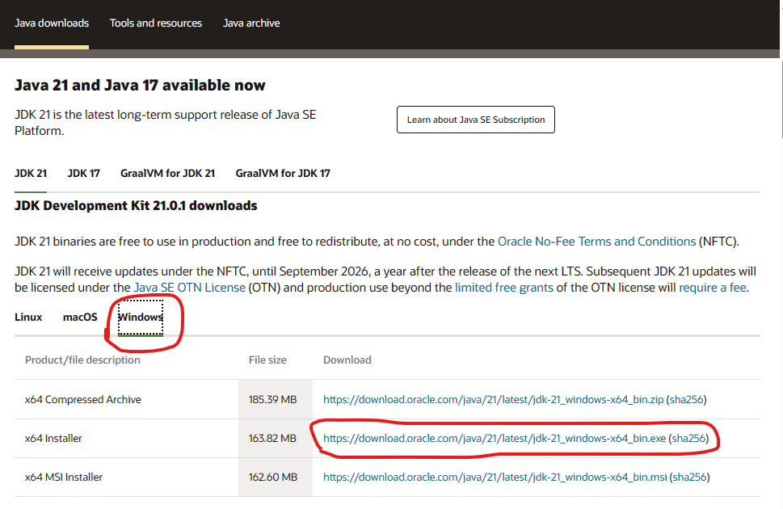
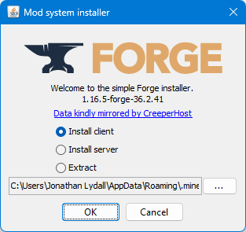
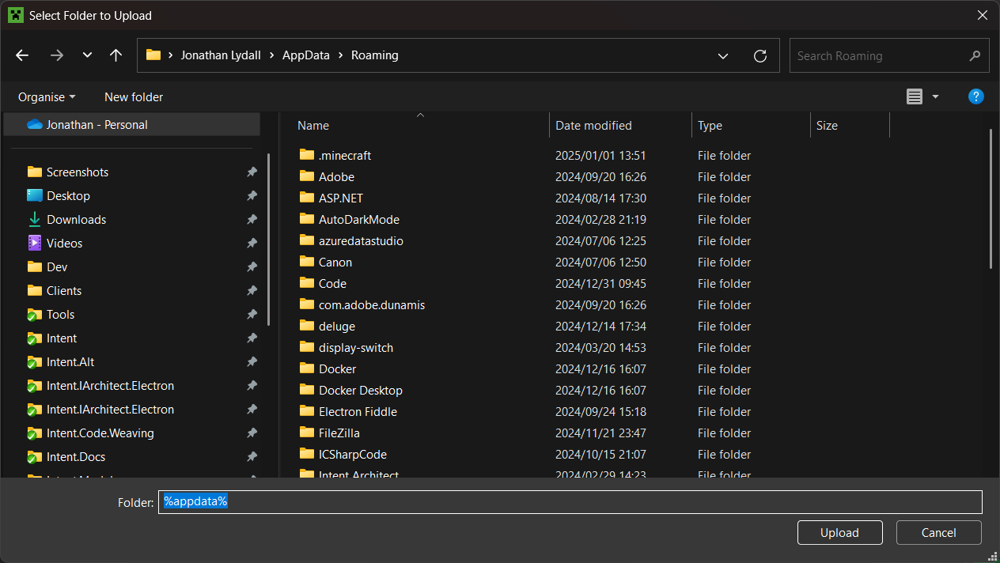
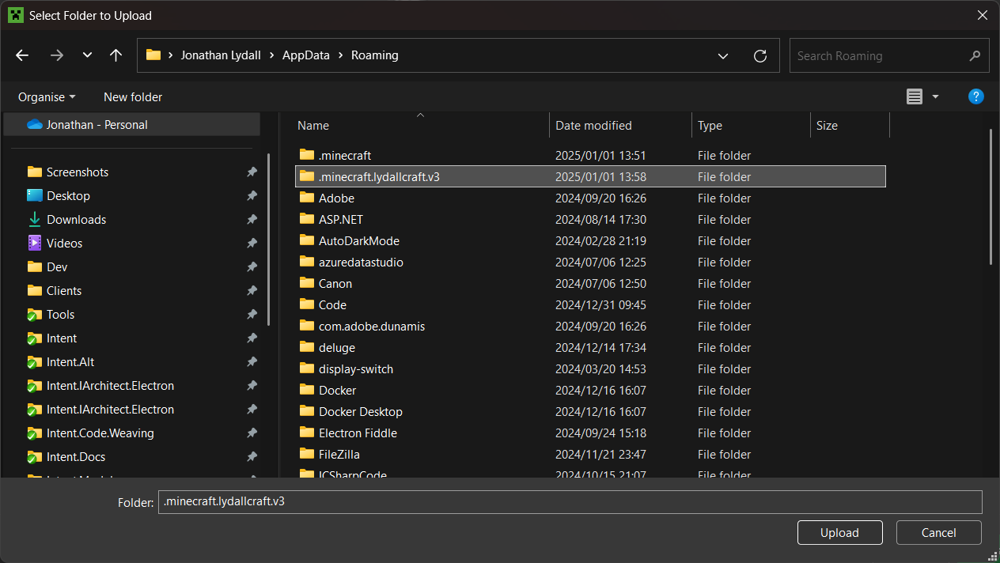

# LydallCraft v3

## Minecraft

You will a valid need Minecraft Java Edition license. Java Edition is the name they eventually gave the original edition of Minecraft for PCs to differentiate it from all the other editions they made later.

If you don't own it already, you can buy it here:

<https://www.minecraft.net/en-us/store/minecraft-java-edition>

If you already have a license, or just bought one, you can download the launcher here:

<https://launcher.mojang.com/download/MinecraftInstaller.msi>

If the above URL stops working, check this page:

<https://www.minecraft.net/en-us/download>

## Forge

The forge installer requires Java to run it, an installer for the latest long-term supported version can be downloaded from [here](https://www.oracle.com/java/technologies/downloads/), once on the page select your OS and file, e.g. Windows and the x64 installer:

Download the *latest* version of Minecraft Forge for MC 1.16.5:

<https://files.minecraftforge.net/net/minecraftforge/forge/index_1.16.5.html>

Open the downloaded `.jar` file to run it.

Choose the *Install client* option:

The installer will then do a bunch of work and when done show a dialogue titled "Complete" with an "OK" button.

## In the Minecraft Launcher

If you had the Minecraft launcher open during installation of Minecraft Forge, you will need to close and re-open it for Minecraft Forge options to be visible.

- Ensure "Minecraft: Java Edition" is selected on the left and then click the "Installations" tab.

  

- Ensure "Modded" is checked at the top-right and then click on the "New installation" button.

  

- Give it a "Name", e.g. `LydallCraft v3`.
- For "Version" select `release 1.16.5-forge-<version>` (hint: you can type `forge` in the box to filter options.)
- Click the "Browse" button.

  

- Type `%appata%` into the folder path at the bottom and press enter:

  

- Press the `New Folder` button near the top left of the dialogue.
- Give the folder a name, e.g. `.minecraft.lydallcraft.v3`.
- Select the folder and press the `Upload` button at the bottom right.

  

- Click the "Folder" icon for the "LydallCraft v3".

  

- Download the zip of our mod pack from <http://mc.mordritch.com/downloads/v3/.minecraft.lydallcraft.v3.2022022701.zip> and extract the contents into the installation folder we opened in the step above:

  

- You can now press "Play".

  
