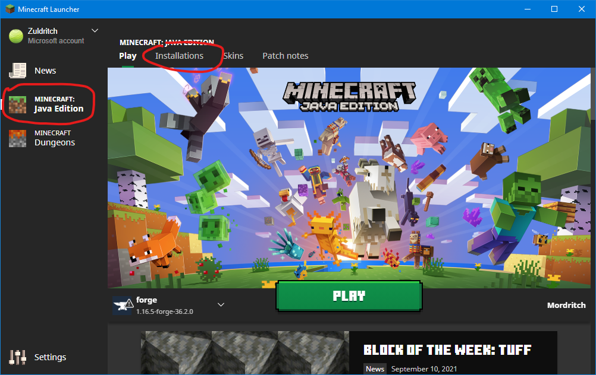
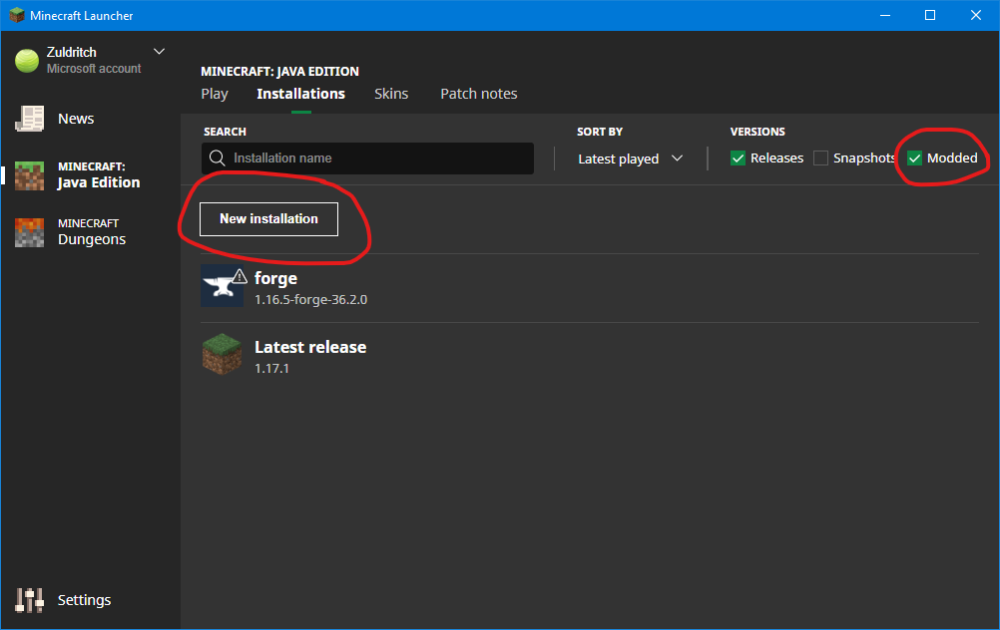
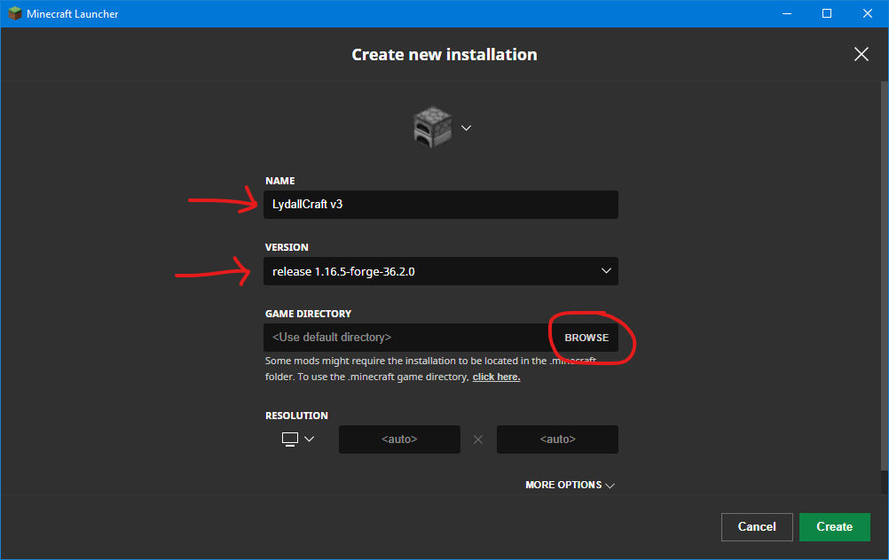
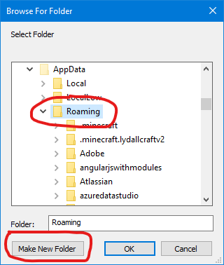
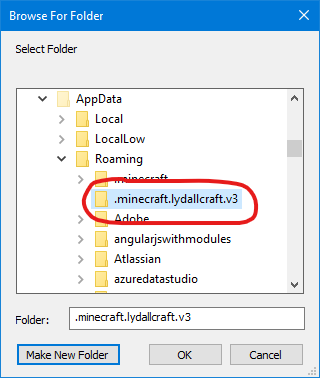
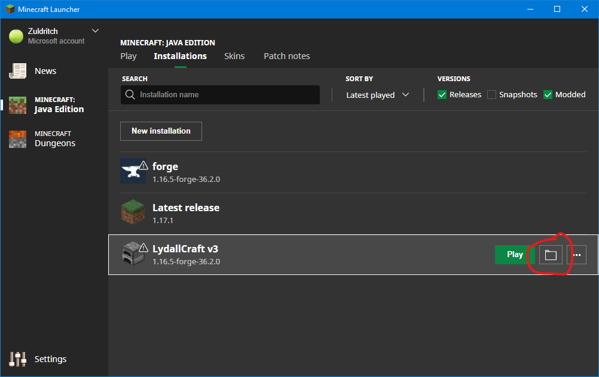
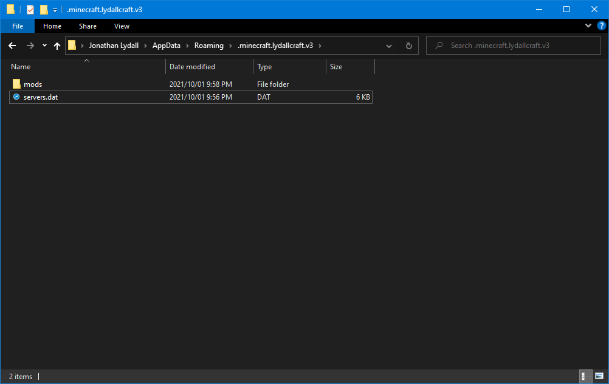
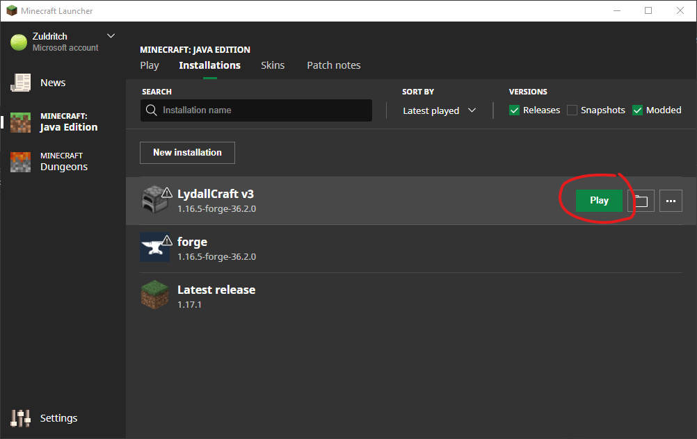

# LydallCraft v3

## Minecraft

You will a valid need Minecraft Java Edition license. Java Edition is the name they eventually gave the original edition of Minecraft for PCs to differentiate it from all the other editions they made later.

If you don't own it already, you can buy it here:

https://www.minecraft.net/en-us/store/minecraft-java-edition

If you already have a license, or just bought one, you can download the launcher here:

https://launcher.mojang.com/download/MinecraftInstaller.msi

If the above URL stops working, check this page:

https://www.minecraft.net/en-us/download

## Forge

Download recommended Forge for MC 1.16.5:

https://maven.minecraftforge.net/net/minecraftforge/forge/1.16.5-36.2.0/forge-1.16.5-36.2.0-installer.jar

Run the download and install the client.

*(Note to self, download listing is [here](https://files.minecraftforge.net/net/minecraftforge/forge/index_1.16.5.html).)*

## In the Minecraft Launcher

Ensure "Minecraft: Java Edition" is selected on the left and then click the "Installations" tab.

Ensure "Modded" is checked at the top-right and then click on the "New installation" button.

Give it a name, for "Version" select `release 1.16.5-forge-36.2.01`, then click the "Browse" button.

Ensure you have the the "Roaming" folder selected, then click the "Make New Folder" button.

Give the folder the name `.minecraft.lydallcraft.v3`, ensure you select the folder afterwards, then click the "OK" button.

Click the "Folder" icon for the "LydallCraft v3" you created.

Get the link to download the mod pack from one of us and extract the contents of the .zip file into the folder that opened.

And finally, you can press "Play".

## Optional components

### Java 16 (optional)

If you have Oracle Java installed, you should uninstall it, Minecraft itself stopped needing it to be installed some time ago.

Download latest Java 16+ from MS:
https://docs.microsoft.com/en-gb/java/openjdk/download

Leave default options during install.

#### Stop launcher blocking newer JDKs

Delete:

`C:\Program Files (x86)\Minecraft\game\JavaCheck.jar`

See: https://bugs.mojang.com/browse/MCL-18306
